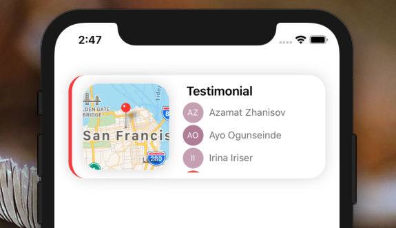

[](https://github.com/Paraboly/react-native-map-card-view)

[](https://github.com/Paraboly/react-native-map-card-view)

[](https://www.npmjs.com/package/@paraboly/react-native-map-card-view)
[](https://www.npmjs.com/package/react-native-map-card-view)

[](https://opensource.org/licenses/MIT)
[](https://github.com/prettier/prettier)

<p align="center">
  
  
</p>

# Installation

Add the dependency:

```ruby
npm i @paraboly/react-native-map-card-view
```

## Peer Dependencies

###### IMPORTANT! You need install them

```js
"react": ">= 16.x.x",
"react-native": ">= 0.55.x",
"react-native-maps": ">= 0.26.1",
"react-native-androw": ">= 0.0.34",
"react-native-user-avatar": ">= 1.0.4",
"@freakycoder/react-native-helpers": "^0.1.0"
```

# Usage

## Import

```jsx
import MapCardView from "@paraboly/react-native-map-card-view";
```

## Usage (IMPORTANT! READ IT BEFORE USE)

To fill the list data. You **HAVE TO** use this format:

**Updated:** "source" is optional now :)

```json
[
  {
    "name": "Azamat Zhanisov",
    "source": "https://images.unsplash.com/photo-1566807810030-3eaa60f3e670?ixlib=rb-1.2.1&auto=format&fit=crop&w=3334&q=80"
  },
  {
    "name": "Ayo Ogunseinde",
    "source": "https://images.unsplash.com/photo-1529626455594-4ff0802cfb7e?ixlib=rb-1.2.1&ixid=eyJhcHBfaWQiOjEyMDd9&auto=format&fit=crop&w=3000&q=80"
  }
]
```

```jsx
<MapCardView
  data={data}
  title="Testimonial"
  colors={["red", "black", "gray"]}
/>
```

# Configuration - Props

| Property         |      Type      |          Default          | Description                                                                       |
| ---------------- | :------------: | :-----------------------: | --------------------------------------------------------------------------------- |
| width            | number, string |    ScreenWidth \* 0.9     | change the width of the card view                                                 |
| height           | number, string |            150            | change the height of the card view                                                |
| title            |     string     |        Testimonial        | change the title                                                                  |
| data             |     array      | dummyData(check the code) | set your own data array however you **HAVE TO** fill the array with above format! |
| markers          |    <Marker>    |      default marker       | set your own Marker JSX Object                                                    |
| styles           |     style      |          default          | change the container's style                                                      |
| mapStyle         |     style      |          default          | change the map's style                                                            |
| titleStyle       |     style      |          default          | change the title's style                                                          |
| shadowStyle      |     style      |          default          | change the shadow's style                                                         |
| shadowColor      |     string     |           #ccc            | change the shadow color                                                           |
| borderColor      |     string     |          #f54242          | change the border color                                                           |
| backgroundColor  |     string     |           #fff            | change the background color                                                       |
| borderLeftWidth  |     number     |             5             | change the left sided border width                                                |
| markerLat        |     number     |         37.78825          | change the default marker latitude                                                |
| markerLng        |     number     |         -122.4324         | change the default marker longitude                                               |
| mapInitialRegion |    lat,lng     |      INITIAL_REGION       | change the map initial region                                                     |
| colors           |     array      |          colors           | change the background color of text avatar                                        |
| size             |     string     |           "30"            | change the size of avatar(image)'s size                                           |

## Future Plans

- [x] ~~LICENSE~~

## Author

FreakyCoder, kurayogun@gmail.com | kuray.ogun@paraboly.com

## License

React Native Map Card View is available under the MIT license. See the LICENSE file for more info.
